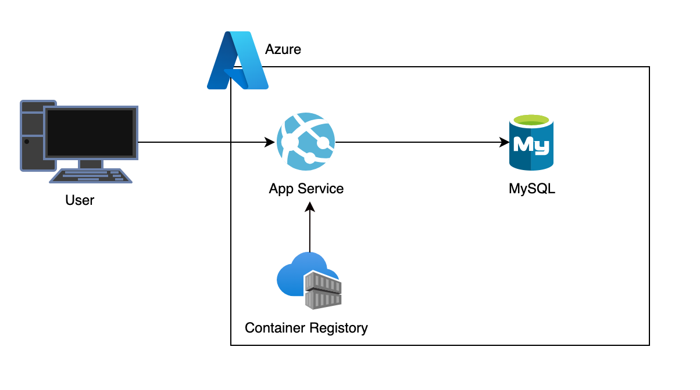

# Todo REST API on Azure

<p align="center">
  
</p>


[](https://www.python.org/)


これは、Ruby on Railsで構築されたシンプルなTodo管理REST APIです。Azure App Service, Azure Database for MySQL, Azure Container Registryを使用してデプロイされています。

## 技術スタック

*   **バックエンド:** Ruby on Rails
*   **データベース:** MySQL (Azure Database for MySQL)
*   **コンテナレジストリ:** Azure Container Registry
*   **ホスティング:** Azure App Service

## APIエンドポイント

| HTTPメソッド | パス             | 説明                     |
| :----------- | :--------------- | :----------------------- |
| `GET`        | `/`              | ルートパス（動作確認用） |
| `POST`       | `/api/todos`     | 新しいTodoを作成します。   |
| `GET`        | `/api/todos/:id` | 指定されたIDのTodoを取得します。 |
| `PUT`        | `/api/todos/:id` | 指定されたIDのTodoを更新します。 |
| `DELETE`     | `/api/todos/:id` | 指定されたIDのTodoを削除します。 |

### リクエスト例

#### POST /api/todos

**リクエストボディ:**

```json
{
  "title": "新しいタスク",
  "completed": false
}
```

**レスポンス (201 Created):**

```json
{
  "id": 1,
  "title": "新しいタスク",
  "completed": false,
  "created_at": "2023-10-27T10:00:00.000Z",
  "updated_at": "2023-10-27T10:00:00.000Z"
}
```

#### GET /api/todos/1

**レスポンス (200 OK):**

```json
{
  "id": 1,
  "title": "新しいタスク",
  "completed": false,
  "created_at": "2023-10-27T10:00:00.000Z",
  "updated_at": "2023-10-27T10:00:00.000Z"
}
```

#### PUT /api/todos/1

**リクエストボディ:**

```json
{
  "completed": true
}
```

**レスポンス (200 OK):**

```json
{
  "id": 1,
  "title": "新しいタスク",
  "completed": true,
  "created_at": "2023-10-27T10:00:00.000Z",
  "updated_at": "2023-10-27T10:05:00.000Z"
}
```

#### DELETE /api/todos/1

**レスポンス (201 No Content):**
```json
{
    "message": "deleted todo with id 1"
}
```


## Azureデプロイメント

このアプリケーションはDockerコンテナ化され、Azure Container Registryにプッシュされた後、Azure App Service上で実行されています。データベースにはAzure Database for MySQLが使用されています。

# 起動とデプロイ方法

以下のコードを実行してインフラを構築します。
```
bin/terraform_apply
```

# 停止
以下のコードを実行すると停止できます。
```
bin/terraform_destroy
```
